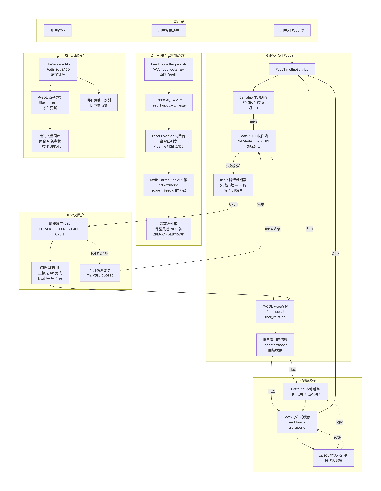

# feed-flow-system · 高并发 Feed 流系统

> 基于 Spring Boot 的 Feed 流系统（推模式收件箱）。实现「写扩散 + 游标分页 + 多级缓存」的读路径，「Fanout 扇出 + Pipeline 批量投递」的写路径，以及**熔断降级兜底**——Redis 故障时容量保持 585 QPS（修复前 99），全程 0 错误。

**核心指标（第二轮压测实测饱和容量，单机混部）：读 886 QPS ｜ 写 874 QPS（超 500 目标 1.75 倍）｜ 混合 986 QPS @ 7:2:1 ｜ 降级 585 QPS，尾延迟 64.7s → 2.24s**

---

## 架构总览



系统分三条路径：

- **写路径（发布动态）**：写入 `feed_detail` 落库后，经 RabbitMQ Fanout Exchange 扇出；FanoutWorker 查询粉丝列表，以 Pipeline 批量 `ZADD` 写入每个粉丝的 Redis 收件箱（Sorted Set，score 为时间戳），并裁剪保留最近 2000 条。
- **读路径（刷 Feed）**：Caffeine 热点收件箱页（短 TTL）→ Redis 收件箱游标分页（`ZREVRANGEBYSCORE`）→ miss 或熔断降级时回源 MySQL 兜底，并批量回填多级缓存。
- **点赞路径**：Redis Set 原子计数 + 明细表唯一索引防重，定时聚合批量刷库。

Redis 不可用时熔断器开路，请求直接走 DB 兜底，**避免同步等待拖垮 Tomcat 线程池**——这是本项目压测驱动调优的核心结论（见下文压测章节）。

## 核心设计

### 1. 推模式收件箱（写扩散）

- **为什么**：Feed 流是典型读多写少场景，读路径性能优先。推模式把聚合成本从「每次读」转移到「每次写」，刷 Feed 时无需跨用户聚合查询，O(1) 读取收件箱。
- **怎么做**：Fanout Worker 消费发布事件，查粉丝列表后用 **Pipeline 批量 ZADD**（一次网络往返写 N 个收件箱），收件箱 `ZREMRANGEBYRANK` 裁剪至最近 2000 条，控制单用户内存占用。
- **效果**：写路径 QPS 874（500 目标的 1.75 倍），扇出延迟稳定。

### 2. 游标分页

- **为什么**：收件箱用 `OFFSET` 深分页会在数据变动时错乱，且越翻越慢。
- **怎么做**：以上一页最后一条的 score（feedId 时间戳）为游标，`ZREVRANGEBYSCORE` 取下一页，天然无偏移、无重复。
- **效果**：翻页性能恒定，不随页深衰减。

### 3. 多级缓存与回填

- **为什么**：热点用户的收件箱首页被高频重复请求，直接穿透到 Redis 会放大网络与序列化开销。
- **怎么做**：Caffeine 本地缓存热点收件箱页（短 TTL 保证新鲜度）→ Redis 分布式缓存动态详情（`feed:feedId` / `user:userId`）→ MySQL 最终数据源；DB 回源后逐级回填。
- **效果**：热点页命中时完全不触碰 Redis，读路径 QPS 886。

### 4. 点赞聚合刷库

- **为什么**：热帖的点赞 QPS 远高于落库需求，逐条 `UPDATE` 会把 DB 连接池打满。
- **怎么做**：点赞写 Redis Set（`SADD` 原子去重 + 原子计数），明细表唯一索引双保险防重复点赞；定时任务聚合 N 条点赞后**一次性条件 UPDATE**（`like_count = like_count + n`）。
- **效果**：压测中点赞路径 1690 QPS，DB 写次数与聚合周期而非点赞量线性相关。

### 5. 熔断降级——压测驱动的关键修复

- **为什么**：第一轮压测暴露致命缺陷——Redis 宕机后，每个请求仍同步等待 Lettuce 连接超时（2s），Tomcat 200 线程被迅速占满锁死，系统容量从 886 QPS **跌至 99 QPS**，尾延迟高达 64.7s。
- **怎么做**：自研轻量熔断器（三状态 CLOSED → OPEN → HALF-OPEN）：失败计数达到阈值即开路，OPEN 期间请求**跳过 Redis 直接走 DB 兜底**，5s 半开探测恢复；同时将 Lettuce 命令超时收紧至 500ms。
- **效果**（第二轮压测验证）：降级容量 99 → **585 QPS**（5.9 倍），尾延迟 64.7s → **2.24s**，降级期间全程 0 错误。

### 6. 降级路径的容量模型

- **为什么**：降级时需要预判 DB 兜底路径的真实容量，而不是等压测给出答案。
- **怎么做**：按 Tomcat 线程模型反推——降级容量 ≈ 线程数 ÷ 单请求耗时。DB 兜底链路（关系查询 + 动态详情 + 批量用户信息）实测服务时间 306ms，200 线程理论容量 ≈ 590 QPS，与实测 585 几乎完全吻合。
- **价值**：容量上限可推导、可解释，扩容方向明确（水平扩实例或优化兜底链路）。

## 技术栈

| 分类 | 组件 |
|---|---|
| 框架 | Spring Boot、MyBatis-Plus |
| 数据 | MySQL 8、Redis（Sorted Set / Pipeline / 游标分页）、Caffeine |
| 中间件 | RabbitMQ（Fanout Exchange） |
| 高可用 | 自研熔断器（三状态）、多级缓存回填、DB 兜底 |
| 压测 | JMeter（CLI 模式 + Forever/Duration 容量测试法） |

## 快速启动

**环境依赖**：JDK 17+、MySQL 8、Redis 6+、RabbitMQ 3.x、Maven 3.8+

```bash
# 1. 建库建表
mysql -uroot -p < src/main/resources/sql/schema.sql

# 2. 配置连接信息（敏感项通过环境变量注入）
#    编辑 src/main/resources/application.yml

# 3. 启动
mvn spring-boot:run
```

配置项均使用 `${ENV_VAR:默认值}` 占位符，启动前请自行设置 MySQL / Redis / RabbitMQ 连接密码。

## 压测

两轮压测，JMeter CLI 模式，Forever + Duration 容量测试法（阶梯加压找拐点，规避斜坡节流造成的虚假吞吐）。

| 场景 | 饱和吞吐 | 结果 |
|---|---|---|
| 刷 Feed（读，4 场景） | 874 ~ 986 QPS | CPU 天花板，全程 0 错误 |
| 发布动态（写） | **874 QPS** | 500 目标的 1.75 倍 ✅ |
| 混合读写（7:2:1） | **986 QPS** | 全程 0 错误 |
| Redis 宕机降级 | **585 QPS** | 修复前 99（5.9×），尾延迟 64.7s → 2.24s |
| 点赞 | 1690 QPS | 达标 |

> 环境定语：Windows 8C16G 单机混部（应用 / MySQL / Redis / RabbitMQ / JMeter 同机），以上数字为该环境下实测饱和容量下限。
> 完整两轮压测分析报告见 `docs/压测报告/`，JMeter 脚本见 `docs/jmeter/`。

## 已知边界与后续计划

以下边界是**已知的主动取舍**，作为后续演进方向：

- **推模式写放大**：大 V（百万粉丝）发布一次触发百万次扇出。设计储备：推拉结合（大 V 走读扩散、普通用户走写扩散）+ 活跃度降级（不活跃粉丝延迟推送）；
- **单表存储**：`feed_detail` 未分表。设计储备：按 user_id 基因法分表，保证收件箱游标与详情路由一致；
- **消费端重试**：FanoutWorker 消费失败 nack 后重新入队，重试上限与 DLQ 尚未接入（计划引入 DLQ + 重试计数，避免毒消息空转）；
- **单机混部**：压测数字为该环境下的容量下限，集群部署下 DB 兜底路径可水平扩展。

## 目录结构

```
src/main/java/com/ygq/feedly/
├── controller/          # 发布 / Feed 流 / 关注 / 点赞接口
├── service/             # FeedTimelineService / FanoutWorker / LikeService 等核心逻辑
├── mq/                  # FanoutMessage 消息体
├── config/              # Redis / RabbitMQ / Druid 配置
├── common/              # 统一响应 Result / CodeMsg / 业务异常
├── handler/             # 全局异常处理
├── entity/ mapper/      # MyBatis-Plus 实体与数据访问层
└── vo/                  # 出入参对象
src/main/resources/
├── application.yml      # 敏感配置均为环境变量占位符
└── sql/schema.sql       # 建表脚本
docs/
├── images/              # 架构图
├── 压测报告/            # 两轮压测完整分析报告
└── jmeter/              # JMeter 压测脚本
```

## License

[MIT](LICENSE)
